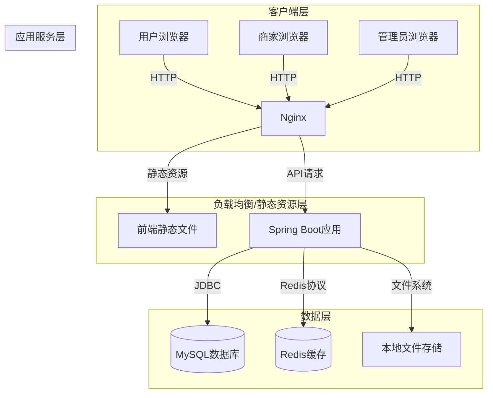
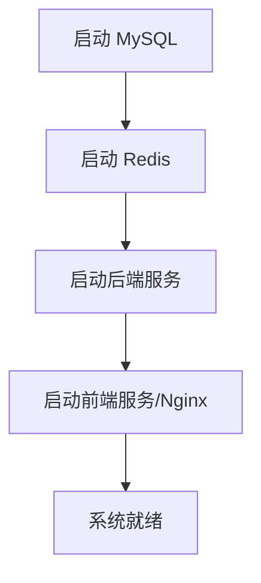

# 摄影器材交易系统 - 项目部署说明

## 文档版本

| 版本 | 日期 | 作者 | 修改说明 |
| :--- | :--- | :--- | :--- |
| V1.0 | 2026-06-21 | 詹仕杰 | 初始版本 |

---

## 1. 项目概述

### 1.1 项目简介

摄影器材交易系统是一个面向摄影爱好者和商家的综合交易平台，支持全新器材购买、二手器材交易和器材租赁三种业务模式。系统采用前后端分离架构，提供用户端、商家端和管理端三个入口。

### 1.2 技术架构

| 层级 | 技术栈 | 版本 |
| :--- | :--- | :--- |
| 前端框架 | Vue.js | 3.5.24 |
| 前端语言 | TypeScript | 5.9.0 |
| UI组件库 | Element Plus | 2.11.7 |
| 前端构建工具 | Vite | 7.1.7 |
| 状态管理 | Pinia | 2.3.1 |
| HTTP客户端 | Axios | 1.13.2 |
| 后端框架 | Spring Boot | 3.5.6 |
| 后端语言 | Java | 17 |
| ORM框架 | MyBatis Plus | 3.5.5 |
| 权限框架 | Sa-Token | 1.37.0 |
| 数据库 | MySQL | 8.0.30 |
| 缓存 | Redis | 7.x+ |
| API文档 | SpringDoc OpenAPI | 2.8.16 |

### 1.3 系统架构图



### 1.4 项目目录结构

```
AAA-BYSJ/
├── BYSJ.PETS.FEC/          # 前端项目
│   ├── src/
│   │   ├── api/            # API接口定义
│   │   ├── components/     # 公共组件
│   │   ├── pages/          # 页面组件
│   │   ├── router/         # 路由配置
│   │   ├── stores/         # 状态管理
│   │   └── utils/          # 工具函数
│   ├── public/             # 静态资源
│   ├── package.json        # 依赖配置
│   └── vite.config.ts      # Vite配置
├── BYSJ.PETS.BEC/          # 后端项目
│   ├── src/main/java/      # Java源代码
│   ├── src/main/resources/
│   │   ├── application.yml # 应用配置
│   │   └── refund.sql      # 退款表SQL
│   └── pom.xml             # Maven配置
├── 数据库文件/              # 数据库初始化脚本
│   ├── db_bysj_pets.sql    # 完整数据库备份
│   └── inventory_trigger.sql # 库存触发器
└── Swagger API接口文档/     # API文档
```

---

## 2. 部署环境要求

### 2.1 操作系统要求

| 项目 | 要求 | 说明 |
| :--- | :--- | :--- |
| 操作系统 | Windows Server 2019 及以上 / Linux (CentOS 8+ / Ubuntu 20.04+) | 生产环境推荐Linux |
| 架构 | x86-64 | 支持64位应用 |
| 内存 | 至少 4GB | 推荐 8GB+ |
| CPU | 至少 2核 | 推荐 4核+ |
| 硬盘 | 至少 50GB 可用空间 | 包含应用、数据库和文件存储 |

### 2.2 软件依赖清单

| 软件 | 版本要求 | 是否必需 | 用途 |
| :--- | :--- | :--- | :--- |
| JDK | 17 | 是 | 后端运行环境 |
| Node.js | ^20.19.0 \|\| >=22.12.0 | 是 | 前端构建环境 |
| MySQL | 8.0.30+ | 是 | 数据库服务 |
| Redis | 7.x+ | 是 | 缓存服务 |
| Maven | 3.8.6+ | 是 | 后端构建工具 |
| Nginx | 1.20+ | 推荐 | 反向代理和静态资源服务 |

---

## 3. 详细部署步骤

### 3.1 环境搭建

#### 3.1.1 Windows 环境搭建

##### 步骤1：安装 JDK 17

1. 下载 JDK 17 安装包（建议使用 Temurin 版本）
2. 运行安装程序，选择安装路径（如 `C:\Program Files\Java\jdk-17`）
3. 配置环境变量：
   - 新增 `JAVA_HOME`：`C:\Program Files\Java\jdk-17`
   - 在 `Path` 中添加：`%JAVA_HOME%\bin`
4. 验证安装：
   ```powershell
   java -version
   ```

##### 步骤2：安装 Node.js

1. 下载 Node.js 20.x 或 22.x 版本安装包
2. 运行安装程序，选择安装路径（如 `C:\Program Files\nodejs`）
3. 验证安装：
   ```powershell
   node -v
   npm -v
   ```

##### 步骤3：安装 MySQL 8.0

1. 下载 MySQL 8.0.30 安装包
2. 运行安装程序，选择 "Developer Default" 类型
3. 设置 root 用户密码为 `123456`（与配置文件一致）
4. 确保 MySQL 服务已启动：
   ```powershell
   net start MySQL80
   ```

##### 步骤4：安装 Redis

1. 下载 Redis 7.x Windows 版本
2. 解压到安装路径（如 `C:\Redis`）
3. 启动 Redis 服务：
   ```powershell
   cd C:\Redis
   redis-server.exe redis.windows.conf
   ```
4. 验证安装：
   ```powershell
   redis-cli.exe ping
   ```

##### 步骤5：安装 Maven

1. 下载 Maven 3.8.6+ 压缩包
2. 解压到安装路径（如 `C:\apache-maven`）
3. 配置环境变量：
   - 新增 `MAVEN_HOME`：`C:\apache-maven`
   - 在 `Path` 中添加：`%MAVEN_HOME%\bin`
4. 验证安装：
   ```powershell
   mvn -v
   ```

#### 3.1.2 Linux 环境搭建（CentOS 8）

##### 步骤1：安装 JDK 17

```bash
sudo yum install -y java-17-openjdk-devel
java -version
```

##### 步骤2：安装 Node.js

```bash
curl -fsSL https://rpm.nodesource.com/setup_20.x | sudo bash -
sudo yum install -y nodejs
node -v
npm -v
```

##### 步骤3：安装 MySQL 8.0

```bash
sudo yum install -y https://dev.mysql.com/get/mysql80-community-release-el8-3.noarch.rpm
sudo yum install -y mysql-community-server
sudo systemctl start mysqld
sudo systemctl enable mysqld
```

初始化密码设置：
```bash
# 查看初始密码
sudo grep 'temporary password' /var/log/mysqld.log

# 登录并修改密码
mysql -u root -p
ALTER USER 'root'@'localhost' IDENTIFIED BY '123456';
```

##### 步骤4：安装 Redis

```bash
sudo yum install -y redis
sudo systemctl start redis
sudo systemctl enable redis
redis-cli ping
```

##### 步骤5：安装 Maven

```bash
sudo yum install -y maven
mvn -v
```

##### 步骤6：安装 Nginx

```bash
sudo yum install -y nginx
sudo systemctl start nginx
sudo systemctl enable nginx
```

### 3.2 数据库配置与初始化

#### 步骤1：创建数据库

```sql
CREATE DATABASE db_bysj_pets 
  CHARACTER SET utf8mb4 
  COLLATE utf8mb4_bin;
```

#### 步骤2：导入数据库备份

```powershell
# Windows
mysql -u root -p123456 db_bysj_pets < "G:\study\AAA-BYSJ\数据库文件\db_bysj_pets.sql"
```

```bash
# Linux
mysql -u root -p123456 db_bysj_pets < /path/to/db_bysj_pets.sql
```

#### 步骤3：导入额外SQL脚本（退款表）

```powershell
mysql -u root -p123456 db_bysj_pets < "G:\study\AAA-BYSJ\BYSJ.PETS.BEC\src\main\resources\refund.sql"
```

#### 步骤4：验证数据库

```sql
USE db_bysj_pets;
SHOW TABLES;
SELECT COUNT(*) FROM user;
```

### 3.3 后端服务部署

#### 步骤1：配置后端参数

编辑 `BYSJ.PETS.BEC/src/main/resources/application.yml`：

```yaml
server:
  port: 9090

spring:
  datasource:
    username: root
    password: 123456
    url: jdbc:mysql://localhost:3306/db_bysj_pets?useSSL=false&serverTimezone=Asia/Shanghai
    driver-class-name: com.mysql.cj.jdbc.Driver
  data:
    redis:
      host: localhost
      port: 6379
      password:
      database: 0
      timeout: 10000

file:
  upload:
    path: /path/to/BYSJ.PETS.FEC/public/images  # 修改为实际路径
  access:
    prefix: http://your-domain.com/images/       # 修改为实际域名

jwt:
  secret: your-secure-secret-key-here           # 生产环境请修改
  expire: 86400000

sa-token:
  jwt-secret-key: your-sa-token-secret-here     # 生产环境请修改
```

**生产环境注意事项**：
- 修改 `jwt.secret` 为随机生成的32位以上字符串
- 修改 `sa-token.jwt-secret-key` 为随机生成的安全密钥
- 修改 `file.upload.path` 为实际的文件存储路径
- 修改 `file.access.prefix` 为实际的访问域名

#### 步骤2：构建后端项目

```powershell
# Windows
cd G:\study\AAA-BYSJ\BYSJ.PETS.BEC
mvn clean package -DskipTests
```

```bash
# Linux
cd /path/to/BYSJ.PETS.BEC
mvn clean package -DskipTests
```

构建成功后，生成的 JAR 文件位于 `target/BYSJ-PETS-BEC-0.0.1-SNAPSHOT.jar`。

#### 步骤3：运行后端服务

**开发环境运行**：
```powershell
mvn spring-boot:run
```

**生产环境运行（后台启动）**：

Windows：
```powershell
java -jar target/BYSJ-PETS-BEC-0.0.1-SNAPSHOT.jar
```

Linux：
```bash
nohup java -jar target/BYSJ-PETS-BEC-0.0.1-SNAPSHOT.jar > logs/app.log 2>&1 &
```

#### 步骤4：验证后端服务

访问 Swagger UI：
```
http://localhost:9090/swagger-ui.html
```

测试健康检查接口：
```powershell
curl http://localhost:9090/api/users/health
```

### 3.4 前端资源部署

#### 步骤1：配置前端参数

编辑 `BYSJ.PETS.FEC/.env`：

```
VITE_APP_BASE_API=/api
```

编辑 `BYSJ.PETS.FEC/vite.config.ts`，修改代理配置（开发环境）：

```typescript
export default defineConfig({
  server: {
    port: 5173,
    proxy: {
      '/api': {
        target: 'http://127.0.0.1:9090',
        changeOrigin: true,
        rewrite: (path) => path.replace(/^\/api/, '')
      }
    }
  }
})
```

#### 步骤2：安装前端依赖

```powershell
cd G:\study\AAA-BYSJ\BYSJ.PETS.FEC
npm install
```

#### 步骤3：构建前端项目

```powershell
npm run build
```

构建成功后，生成的静态文件位于 `dist/` 目录。

#### 步骤4：部署前端资源

**方式一：使用 Vite 预览（开发环境）**

```powershell
npm run preview -- --port 8080
```

**方式二：使用 Nginx 部署（生产环境）**

配置 Nginx：

```nginx
server {
    listen 80;
    server_name your-domain.com;

    # 前端静态资源
    location / {
        root /path/to/BYSJ.PETS.FEC/dist;
        index index.html;
        try_files $uri $uri/ /index.html;
    }

    # API 代理到后端
    location /api/ {
        proxy_pass http://127.0.0.1:9090/;
        proxy_set_header Host $host;
        proxy_set_header X-Real-IP $remote_addr;
        proxy_set_header X-Forwarded-For $proxy_add_x_forwarded_for;
    }

    # 图片资源
    location /images/ {
        alias /path/to/BYSJ.PETS.FEC/public/images/;
        expires 30d;
    }
}
```

**方式三：使用 IIS 部署（Windows 生产环境）**

1. 将 `dist/` 目录复制到 IIS 网站目录
2. 配置网站绑定到 80 端口
3. 配置 URL 重写规则（用于 SPA 路由）：

```xml
<configuration>
    <system.webServer>
        <rewrite>
            <rules>
                <rule name="Vue Router" stopProcessing="true">
                    <match url=".*" />
                    <conditions logicalGrouping="MatchAll">
                        <add input="{REQUEST_FILENAME}" matchType="IsFile" negate="true" />
                        <add input="{REQUEST_FILENAME}" matchType="IsDirectory" negate="true" />
                    </conditions>
                    <action type="Rewrite" url="/index.html" />
                </rule>
            </rules>
        </rewrite>
    </system.webServer>
</configuration>
```

#### 步骤5：验证前端服务

访问前端页面：
```
http://localhost:5173  (开发环境)
http://localhost:8080  (预览模式)
http://your-domain.com (生产环境)
```

### 3.5 系统配置

#### 3.5.1 文件存储配置

确保文件上传目录存在并具有写入权限：

```powershell
# Windows
New-Item -ItemType Directory -Force -Path "G:\study\AAA-BYSJ\BYSJ.PETS.FEC\public\images"
```

```bash
# Linux
mkdir -p /path/to/BYSJ.PETS.FEC/public/images
chmod -R 755 /path/to/BYSJ.PETS.FEC/public/images
```

#### 3.5.2 Redis 配置优化

编辑 Redis 配置文件 `redis.conf`：

```
# 最大内存限制
maxmemory 2gb
maxmemory-policy allkeys-lru

# 持久化配置
save 60 1000
rdbcompression yes
```

#### 3.5.3 MySQL 配置优化

编辑 MySQL 配置文件 `my.cnf` 或 `my.ini`：

```ini
[mysqld]
# 字符集
character-set-server=utf8mb4
collation-server=utf8mb4_bin

# 连接数
max_connections=1000
wait_timeout=600

# 缓冲池大小（建议设置为物理内存的50%-70%）
innodb_buffer_pool_size=4G
innodb_log_file_size=512M

# 查询缓存（MySQL 8.0已移除）
query_cache_type=0
```

---

## 4. 部署验证方法

### 4.1 服务可用性验证

| 服务 | 验证地址 | 预期结果 |
| :--- | :--- | :--- |
| 前端 | http://localhost:5173 | 显示登录页面 |
| 后端API | http://localhost:9090/api/users/health | 返回 JSON 响应 |
| Swagger | http://localhost:9090/swagger-ui.html | 显示 API 文档 |
| MySQL | `mysql -u root -p123456` | 成功登录 |
| Redis | `redis-cli ping` | 返回 PONG |

### 4.2 功能验证流程

**步骤1：用户注册**

1. 访问前端首页
2. 点击"注册"按钮
3. 填写注册信息（用户名、密码、邮箱）
4. 验证注册成功，数据库中新增用户记录

**步骤2：用户登录**

1. 使用注册的账号登录
2. 验证登录成功后跳转到首页
3. 验证 Token 正确存储

**步骤3：商品浏览**

1. 浏览商品列表
2. 查看商品详情
3. 验证商品图片正常显示

**步骤4：购物车操作**

1. 将商品加入购物车
2. 查看购物车列表
3. 删除购物车商品

**步骤5：订单创建**

1. 选择商品结算
2. 填写收货地址
3. 提交订单
4. 验证订单状态正确

### 4.3 管理后台验证

**步骤1：管理员登录**

管理员账号：`admin`（默认密码需查看数据库）

```sql
SELECT username, password FROM user WHERE user_type = 1;
```

**步骤2：商品管理**

1. 进入商品管理页面
2. 查看商品列表
3. 审核商品
4. 验证审核状态更新

**步骤3：商家审核**

1. 进入商家审核页面
2. 审核商家申请
3. 验证商家状态更新

---

## 5. 系统启动与停止流程

### 5.1 启动流程



**Windows 启动脚本**：

```powershell
# start-services.ps1
Write-Host "启动 MySQL..."
net start MySQL80

Write-Host "启动 Redis..."
Start-Process -FilePath "C:\Redis\redis-server.exe" -ArgumentList "C:\Redis\redis.windows.conf"

Write-Host "启动后端服务..."
cd G:\study\AAA-BYSJ\BYSJ.PETS.BEC
Start-Process -FilePath "java" -ArgumentList "-jar", "target/BYSJ-PETS-BEC-0.0.1-SNAPSHOT.jar"

Write-Host "启动前端服务..."
cd G:\study\AAA-BYSJ\BYSJ.PETS.FEC
Start-Process -FilePath "npm" -ArgumentList "run", "dev"

Write-Host "所有服务已启动"
```

**Linux 启动脚本**：

```bash
#!/bin/bash
# start-services.sh

echo "启动 MySQL..."
sudo systemctl start mysqld

echo "启动 Redis..."
sudo systemctl start redis

echo "启动后端服务..."
cd /path/to/BYSJ.PETS.BEC
nohup java -jar target/BYSJ-PETS-BEC-0.0.1-SNAPSHOT.jar > logs/app.log 2>&1 &

echo "启动 Nginx..."
sudo systemctl start nginx

echo "所有服务已启动"
```

### 5.2 停止流程

**Windows 停止脚本**：

```powershell
# stop-services.ps1
Write-Host "停止前端服务..."
Stop-Process -Name node -Force

Write-Host "停止后端服务..."
Stop-Process -Name java -Force

Write-Host "停止 Redis..."
Stop-Process -Name redis-server -Force

Write-Host "停止 MySQL..."
net stop MySQL80

Write-Host "所有服务已停止"
```

**Linux 停止脚本**：

```bash
#!/bin/bash
# stop-services.sh

echo "停止 Nginx..."
sudo systemctl stop nginx

echo "停止后端服务..."
pkill -f "BYSJ-PETS-BEC"

echo "停止 Redis..."
sudo systemctl stop redis

echo "停止 MySQL..."
sudo systemctl stop mysqld

echo "所有服务已停止"
```

### 5.3 服务状态检查

**Windows**：

```powershell
# 检查所有服务状态
Get-Service MySQL80, Redis | Select-Object Name, Status

# 检查 Java 进程
Get-Process java -ErrorAction SilentlyContinue | Select-Object Id, ProcessName

# 检查 Node 进程
Get-Process node -ErrorAction SilentlyContinue | Select-Object Id, ProcessName
```

**Linux**：

```bash
# 检查服务状态
sudo systemctl status mysqld redis nginx

# 检查 Java 进程
ps aux | grep "BYSJ-PETS-BEC"

# 检查端口占用
netstat -tlnp | grep -E "9090|80"
```

---

## 6. 常见问题解决方案

### 6.1 数据库连接问题

**问题现象**：后端启动时无法连接数据库

**解决方案**：

1. 检查 MySQL 服务是否启动：
   ```powershell
   net start MySQL80  # Windows
   sudo systemctl start mysqld  # Linux
   ```

2. 检查数据库配置是否正确：
   - 确认用户名和密码正确
   - 确认数据库名称为 `db_bysj_pets`
   - 确认端口为 `3306`

3. 检查防火墙设置：
   ```powershell
   # Windows 允许 MySQL 端口
   netsh advfirewall firewall add rule name="MySQL" dir=in action=allow protocol=TCP localport=3306
   ```

   ```bash
   # Linux 允许 MySQL 端口
   sudo firewall-cmd --zone=public --add-port=3306/tcp --permanent
   sudo firewall-cmd --reload
   ```

### 6.2 Redis 连接问题

**问题现象**：后端启动时 Redis 连接失败

**解决方案**：

1. 检查 Redis 服务是否启动：
   ```powershell
   redis-cli ping
   ```

2. 检查 Redis 配置：
   - 确认 `application.yml` 中 Redis 配置正确
   - 确认 Redis 未设置密码（或密码配置正确）

3. 检查防火墙设置：
   ```bash
   sudo firewall-cmd --zone=public --add-port=6379/tcp --permanent
   sudo firewall-cmd --reload
   ```

### 6.3 前端页面空白

**问题现象**：访问前端页面显示空白

**解决方案**：

1. 检查前端是否正常构建：
   ```powershell
   npm run build
   ```

2. 检查浏览器控制台错误：
   - 按 F12 打开开发者工具
   - 查看 Console 面板的错误信息

3. 检查 API 代理配置：
   - 确认 `vite.config.ts` 中代理配置正确
   - 确认后端服务正常运行

4. 检查静态资源路径：
   - 确认 `dist/` 目录存在且包含 `index.html`

### 6.4 文件上传失败

**问题现象**：上传商品图片失败

**解决方案**：

1. 检查文件上传目录权限：
   ```bash
   chmod -R 755 /path/to/BYSJ.PETS.FEC/public/images
   ```

2. 检查文件大小限制：
   - `application.yml` 中配置了 `max-file-size: 10MB` 和 `max-request-size: 50MB`
   - 确认上传文件不超过限制

3. 检查路径配置：
   - 确认 `file.upload.path` 配置正确
   - 确认目录存在

### 6.5 登录失败

**问题现象**：用户登录失败，提示"用户名或密码错误"

**解决方案**：

1. 检查数据库中用户记录：
   ```sql
   SELECT username, password, status FROM user WHERE username = 'your_username';
   ```

2. 检查密码加密方式：
   - 系统使用 BCrypt 加密密码
   - 确认注册时密码正确加密存储

3. 检查 Token 配置：
   - 确认 `jwt.secret` 配置正确
   - 确认 `sa-token.jwt-secret-key` 配置正确

### 6.6 端口占用问题

**问题现象**：启动服务时提示端口已被占用

**解决方案**：

```powershell
# Windows 查找占用端口的进程
netstat -ano | findstr :9090
taskkill /F /PID <进程ID>
```

```bash
# Linux 查找占用端口的进程
lsof -i :9090
kill -9 <进程ID>
```

### 6.7 Maven 构建失败

**问题现象**：执行 `mvn package` 时失败

**解决方案**：

1. 检查网络连接：
   - 确保可以访问 Maven 中央仓库
   - 配置 Maven 镜像（如阿里云）

2. 清理并重新构建：
   ```powershell
   mvn clean install -DskipTests
   ```

3. 检查 JDK 版本：
   ```powershell
   java -version
   ```
   确认使用 JDK 17。

---

## 7. 安全注意事项

### 7.1 数据库安全

1. **修改默认密码**：
   - 修改 MySQL `root` 用户密码为强密码
   - 创建专用数据库用户，授予最小权限

2. **限制数据库访问**：
   - 仅允许本地或特定 IP 访问数据库
   - 禁止远程 root 登录

3. **定期备份**：
   ```bash
   # MySQL 备份脚本
   mysqldump -u root -p db_bysj_pets > backup_$(date +%Y%m%d).sql
   ```

### 7.2 应用安全

1. **修改密钥**：
   - 修改 `jwt.secret` 为随机生成的安全密钥
   - 修改 `sa-token.jwt-secret-key` 为随机生成的安全密钥

2. **禁用调试模式**：
   - 生产环境关闭 SQL 日志输出
   - 关闭 Swagger UI

3. **配置 HTTPS**：
   - 申请 SSL 证书
   - 配置 Nginx 或 IIS 启用 HTTPS

### 7.3 服务器安全

1. **防火墙配置**：
   - 仅开放必要端口（80、443、9090）
   - 限制 SSH 访问

2. **定期更新**：
   - 定期更新操作系统补丁
   - 定期更新软件版本

3. **日志监控**：
   - 配置应用日志记录
   - 定期检查日志，发现异常行为

### 7.4 文件安全

1. **文件上传验证**：
   - 限制上传文件类型（仅允许图片格式）
   - 限制上传文件大小
   - 对上传文件进行病毒扫描

2. **文件存储隔离**：
   - 文件存储目录与应用程序目录分离
   - 配置适当的文件权限

### 7.5 数据安全

1. **数据加密**：
   - 敏感数据（如密码）使用 BCrypt 加密存储
   - 传输数据使用 HTTPS 加密

2. **数据脱敏**：
   - 日志中对敏感信息进行脱敏处理
   - 接口返回数据中对敏感字段进行脱敏

3. **访问控制**：
   - 基于角色的权限控制
   - 最小权限原则

---

## 8. 附录

### 8.1 默认账号

| 角色 | 用户名 | 密码 | 说明 |
| :--- | :--- | :--- | :--- |
| 超级管理员 | admin | 需从数据库查询 | 系统最高权限 |
| 普通用户 | - | - | 需自行注册 |
| 商家 | - | - | 注册后需管理员审核 |

### 8.2 端口说明

| 服务 | 端口 | 说明 |
| :--- | :--- | :--- |
| 前端开发 | 5173 | Vite 开发服务器 |
| 前端预览 | 8080 | Vite 预览服务器 |
| 后端服务 | 9090 | Spring Boot 应用 |
| MySQL | 3306 | 数据库服务 |
| Redis | 6379 | 缓存服务 |
| Nginx | 80/443 | 反向代理 |

### 8.3 数据库表清单

| 表名 | 说明 |
| :--- | :--- |
| user | 用户表 |
| product | 商品表 |
| category | 分类表 |
| brand | 品牌表 |
| orders | 订单表 |
| order_item | 订单项表 |
| cart | 购物车表 |
| favorite | 收藏表 |
| evaluation | 评价表 |
| inventory | 库存表 |
| inventory_history | 库存历史表 |
| permission | 权限表 |
| role | 角色表 |
| role_permission | 角色权限关联表 |
| sku | SKU表 |
| product_image | 商品图片表 |
| user_address | 用户地址表 |
| payment | 支付记录表 |
| refund | 退款表 |
| sys_notice | 系统公告表 |

### 8.4 配置文件说明

**后端配置文件 `application.yml`**：

| 配置项 | 默认值 | 说明 |
| :--- | :--- | :--- |
| server.port | 9090 | 后端服务端口 |
| spring.datasource.url | jdbc:mysql://localhost:3306/db_bysj_pets | 数据库连接地址 |
| spring.datasource.username | root | 数据库用户名 |
| spring.datasource.password | 123456 | 数据库密码 |
| spring.data.redis.host | localhost | Redis 地址 |
| spring.data.redis.port | 6379 | Redis 端口 |
| file.upload.path | G:/study/AAA-BYSJ/BYSJ.PETS.FEC/public/images | 文件上传路径 |
| file.access.prefix | http://localhost:5173/images/ | 图片访问前缀 |
| jwt.secret | defaultSecretKeyForDev... | JWT 密钥 |
| jwt.expire | 86400000 | JWT 过期时间（毫秒） |
| sa-token.token-name | token | Token 名称 |
| sa-token.timeout | 2592000 | Token 有效期（秒） |

**前端配置文件 `.env`**：

| 配置项 | 默认值 | 说明 |
| :--- | :--- | :--- |
| VITE_APP_BASE_API | /api | API 基础路径 |

### 8.5 命令速查

**后端常用命令**：

```powershell
# 进入后端目录
cd G:\study\AAA-BYSJ\BYSJ.PETS.BEC

# 编译项目
mvn compile

# 运行测试
mvn test

# 打包（跳过测试）
mvn clean package -DskipTests

# 运行项目
mvn spring-boot:run

# 运行打包后的 JAR
java -jar target/BYSJ-PETS-BEC-0.0.1-SNAPSHOT.jar
```

**前端常用命令**：

```powershell
# 进入前端目录
cd G:\study\AAA-BYSJ\BYSJ.PETS.FEC

# 安装依赖
npm install

# 开发模式运行
npm run dev

# 构建生产版本
npm run build

# 预览生产版本
npm run preview

# 代码检查
npm run lint

# 类型检查
npm run type-check
```

**数据库常用命令**：

```powershell
# 登录 MySQL
mysql -u root -p123456

# 使用数据库
USE db_bysj_pets;

# 查看表
SHOW TABLES;

# 导出数据库
mysqldump -u root -p123456 db_bysj_pets > backup.sql

# 导入数据库
mysql -u root -p123456 db_bysj_pets < backup.sql
```

**Redis 常用命令**：

```powershell
# 进入 Redis 命令行
redis-cli

# 测试连接
ping

# 查看所有键
keys *

# 清空缓存
flushall
```

---

## 9. 联系方式

| 项目 | 信息 |
| :--- | :--- |
| 项目负责人 | 詹仕杰 |
| 学号 | 2240709305 |
| 邮箱 | 3324879861@qq.com |

---

*文档结束*
